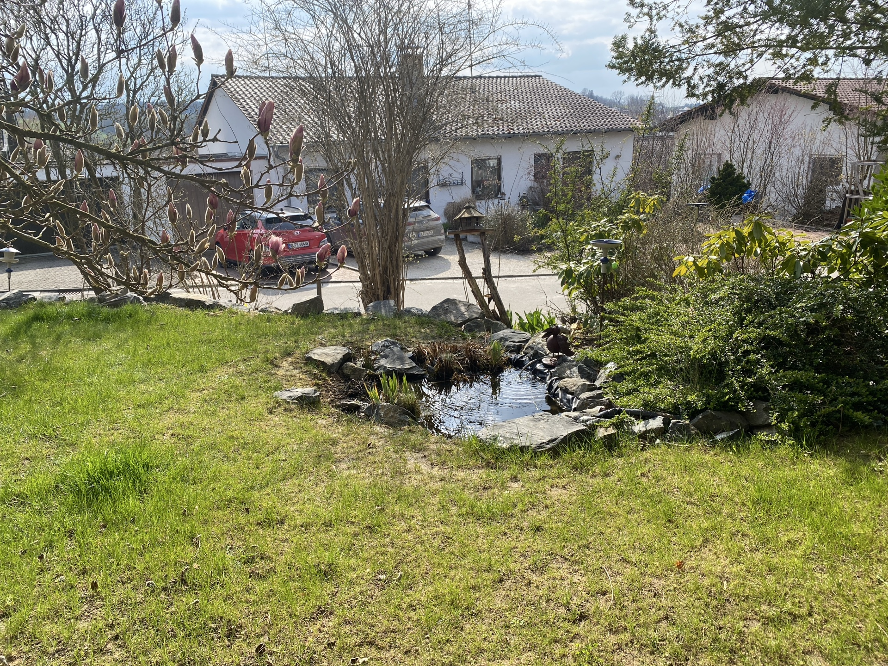
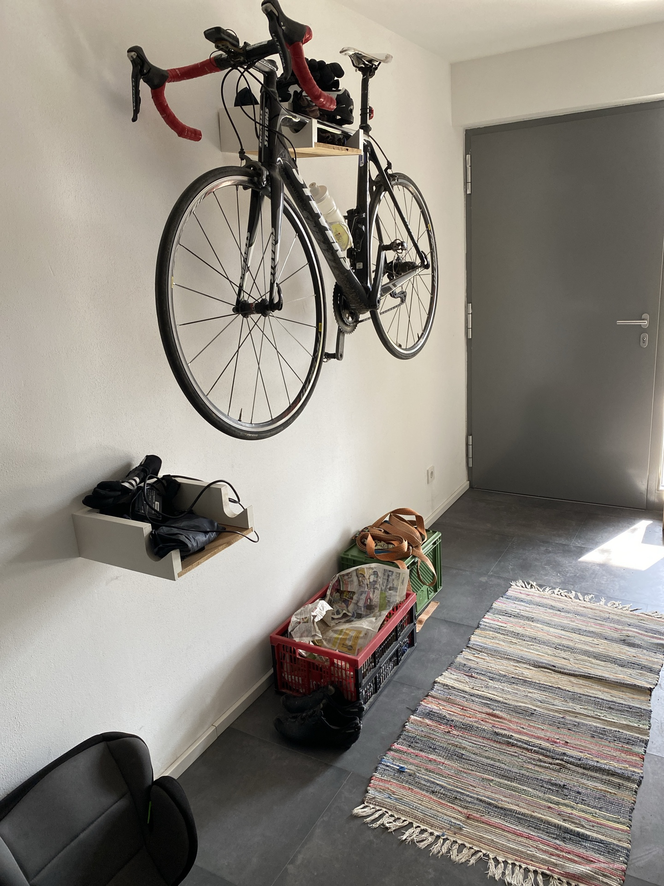

# First Lab KI-Systeme

Over all task is to build a robot that can detect litter and notify its operator.

This project was build with the autoresaerch idea of Andrew Karpathy: https://github.com/karpathy/autoresearch

The overall idea is to critically look at the experiments and progress the AI made, identify improvements and integrate a further improved version into a robot setup.

Other approaches fine-tune a yolo model: e.g. see for https://github.com/jeremy-rico/litter-detection

## 1 Student Task

- [Task Description](docs/student_task.md)
- [Context to this project](docs/explainer.md)

## Example images not in the dataset

| No litter                    | Litter                       |
|------------------------------|------------------------------|
|  |  |

## Autoresearch Content

> Note: There is already one good model in this repository. Thus you should be able to investigate the performance using the Analysis Notebook.

- [Analysis Notebook](auto-research/analysis.ipynb)
- [Instructions](auto-research/program.md)

## Setup

Init project:

```bash
uv sync
```

Content:

- There is a [analysis.ipynb](auto-research/analysis.ipynb) notebook to take a first look on the project and test the existing models.
- The project contains a mlflow project that stores the hole experiment and training history.
  Run the following command to launch the mlflow server and ui
  ```bash
  uv run mlflow ui --backend-store-uri sqlite:///mlflow.db
  ```
  >To upgrade outdated DB: `uv run mlflow db upgrade sqlite:///mlflow.db`

### Run Camera:
```bash
uv run camera [--source webcam/go2] [--id DeviceID]
```

### Run Detector:

By default the detector loads from the MLflow registry (`models:/litter-segmentation/latest`). To run against a shared `.onnx` checkpoint from `models/` instead, pass `--model`:

```bash
# MLflow (default)
uv run detector

# Local ONNX file
uv run detector --model models/best_resnet34.onnx
uv run detector --model models/best_efficientnetb4.onnx
```

You can also set `LITTER_MODEL_URI` to make a choice sticky for the shell. ONNX inference runs on CPU by default; GPU ONNX requires installing `onnxruntime-gpu` with a CUDA version matching the torch wheels.

### Distributing trained models

Training writes both `models/best_model.pth` (state-dict, for resume-training) and `models/best_model.onnx` (self-contained graph + weights, for distribution). To share a named checkpoint across machines, rename the `.onnx` to something descriptive and commit it directly:

```bash
# From an existing .pth:
uv run python scripts/export_onnx.py --arch resnet34 --pth models/best_resnet34.pth

git add models/best_resnet34.onnx
git commit -m "models: add best_resnet34.onnx"
```

The `.onnx` format is architecture-agnostic at load time, so adding a new architecture (EfficientNet, MobileNet, …) needs no changes to the detector. Keep the number of tracked model files small — each update bakes the full binary into git history.

### Run Grafana OTel LGTM 
```
cd docker
docker compose up -d
```


## Additional Content

- [Experiment Tracking](https://mlflow.org/docs/latest/ml/getting-started/deep-learning/)