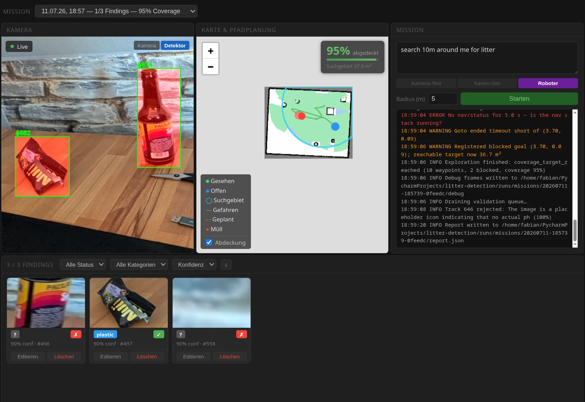

# First Lab KI-Systeme

Overall task is to build a robot that can detect litter and notify its operator.

The project has grown into three cooperating subsystems:

1. **Autoresearch training** — CNN segmentation models trained on the TACO dataset,
   using the autoresearch idea of Andrej Karpathy (https://github.com/karpathy/autoresearch):
   critically look at the experiments and progress the AI made, identify improvements
   and integrate a further improved version into a robot setup.
2. **Real-time detector pipeline** — a camera publisher and a segmentation/detection
   detector with multi-object tracking, communicating over [Zenoh](https://zenoh.io/),
   deployable on a Unitree Go2.
3. **Multi-agent litter-search missions** — an agent system that drives the Go2 to
   autonomously search an area for litter and validates finds with a vision LLM.

Besides the segmentation approach, the detector also runs fine-tuned YOLO11/YOLOv8-seg
models (cf. https://github.com/jeremy-rico/litter-detection).

## 1 Student Task

- [Task Description](docs/student_task.md)
- [Context to this project](docs/explainer.md)

## Example images not in the dataset

| No litter                    | Litter                       |
|------------------------------|------------------------------|
|  |  |

## Autoresearch Content

> Note: There is already one good model in this repository. Thus you should be able to investigate the performance using the Analysis Notebook.

- [Analysis Notebook](auto-research/analysis.ipynb)
- [Instructions](auto-research/program.md)

## Setup

Init project:

```bash
uv sync
```

Content:

- There is a [analysis.ipynb](auto-research/analysis.ipynb) notebook to take a first look on the project and test the existing models.
- The project contains a mlflow project that stores the whole experiment and training history.
  Run the following command to launch the mlflow server and ui
  ```bash
  uv run mlflow ui --backend-store-uri sqlite:///mlflow.db
  ```
  >To upgrade outdated DB: `uv run mlflow db upgrade sqlite:///mlflow.db`

### Run Camera:
```bash
uv run camera [--source webcam/go2] [--id DeviceID]
```

Captures frames from a local webcam or from the Go2 robot (via Zenoh) and publishes
JPEG frames on `litter/frame` for the detector to consume.

### Run Detector:

```bash
uv run detector [--model URI]
```

The detector subscribes to camera frames, segments litter, tracks objects and
republishes the mask, overlay and tracked-object messages over Zenoh.

`--model` accepts three kinds of source:

- an **MLflow URI** (`models:/litter-segmentation/latest`, `runs:/<id>/model`),
- a local **`.onnx`** file — a U-Net segmentation model, or
- a local **`.pt`** file — a YOLO11/YOLOv8-seg model (via ultralytics).

With no `--model` and no `LITTER_MODEL_URI` / `MLFLOW_MODEL_URI` env var, the detector
**auto-detects a local checkpoint** in `models/`, preferring (in order)
`best_yolo11s_seg.pt`, `best_resnet34.onnx`, `best_efficientnetb4.onnx`,
`best_model.onnx`, and only falls back to the MLflow registry
(`models:/litter-segmentation/latest`) if none are present.

```bash
# Auto-detect a local model (YOLO .pt is preferred if present)
uv run detector

# Explicit YOLO segmentation model
uv run detector --model models/best_yolo11s_seg.pt

# Explicit U-Net ONNX checkpoint
uv run detector --model models/best_resnet34.onnx
uv run detector --model models/best_efficientnetb4.onnx
```

Set `LITTER_MODEL_URI` to make a choice sticky for the shell. ONNX inference runs on
CPU by default; GPU ONNX requires installing `onnxruntime-gpu` with a CUDA version
matching the torch wheels.

### Object tracking

The detector runs a ByteTrack-style multi-object tracker on top of the segmentation
mask. Connected components extract per-object bounding boxes from the mask each frame,
a Kalman filter predicts where each known object should appear next, and IoU-based
Hungarian assignment (with a high/low confidence split and an optional colour-histogram
appearance tiebreaker) links new detections to existing tracks. Confirmed tracks are
persisted to a local SQLite registry (`runs/objects.db` by default) with first-seen /
last-seen timestamps and republished over Zenoh on `litter/tracked`. Bounding boxes plus
IDs are also drawn on `litter/masked_frame`.

Tunable via env vars (Pydantic Settings):

| Variable | Default | Meaning |
| --- | --- | --- |
| `TRACKER_MIN_AREA_PX` | 50 | drop mask blobs below this many pixels (noise filter) |
| `TRACKER_IOU_THRESHOLD` | 0.2 | minimum IoU for a (detection, prediction) match |
| `TRACKER_DET_HIGH_THRESH` | 0.7 | confidence split: detections at/above this can spawn new tracks |
| `TRACKER_MIN_HITS` | 3 | observations required before a track is emitted/persisted |
| `TRACKER_MAX_AGE` | 75 | frames a track may go unmatched before it's killed |
| `TRACKER_COUNT_MIN_OBSERVATIONS` | 10 | observations required before a track ticks the unique-objects counter (filters flickery blobs) |
| `TRACKER_MASK_ERODE_KERNEL` | 3 | square erosion kernel applied to the mask before extraction; separates touching blobs into distinct tracks (set 0 to disable) |
| `TRACKER_MIN_CONFIDENCE` | 0.45 | drop detections whose mean sigmoid prob (inside the blob) is below this value |
| `TRACKER_APPEARANCE_WEIGHT` | 0.3 | weight of the colour-histogram appearance tiebreaker (0 = pure IoU) |
| `REGISTRY_DB_PATH` | `runs/objects.db` | SQLite path for the persistent object registry |

The detector also has a temporal-smoothing EWMA (`DETECTOR_TEMPORAL_ALPHA`) and an
optional IMU stability gate (`STABILITY_IMU_TOPIC`) that skips frames captured while the
robot is shaking. See [docs/tracking.md](docs/tracking.md) for the full architecture,
lifecycle diagram, schema, and the multi-agent extension path.

### Run a litter-search mission

The multi-agent system (`src/litter_agents/`) drives the Go2 to autonomously search an
area for litter. A Pydantic-AI agent parses the natural-language prompt into a search
area, a deterministic exploration loop plans coverage waypoints, and an async validation
worker crops stable tracks and has an Ollama Cloud vision agent verify/classify them.
Findings are persisted to SQLite (`runs/findings.db`) with crops under `runs/missions/<id>/`.

```bash
# Full mission — needs the zenoh router, the robodog stack (localization + nav),
# and `uv run camera` + `uv run detector` running alongside.
uv run litter-mission "Search 10m around me for litter"
uv run litter-mission "Check the area in front of me" --confirm
uv run litter-mission --circle 5 "manual area" --no-llm-summary   # bypass the area agent
```

The LLM calls need `OLLAMA_API_KEY` (Ollama Cloud, OpenAI-compatible endpoint
`https://ollama.com/v1`); model names are configurable via `AgentSettings` in
`src/litter_agents/config.py`.

**Map source** — the static map is loaded through a `MapProvider` (`map_source`
setting). The default (`file`) reads a local `map_server` YAML+PNG. To pull the
live map straight from the robodog-digipro MOLA SLAM control API instead, use
`--map-source mola` (auto-selects the newest mapping session; `--mola-build-grid`
builds the 2D costmap on demand):

```bash
uv run litter-mission "Search around me" --map-source mola --mola-build-grid
uv run litter-mission "Search around me" --map-source mola --mola-session hall-b_2026-07
```

**Offline exploration sim** — runs the identical exploration loop against the static map
with fake nav/pose, so no robot, zenoh or LLM is needed. Renders frames to `runs/sim/`:

```bash
uv run litter-sim --circle 5
uv run litter-sim --circle 5 --block -10.7 -0.3 0.5   # simulate an unmapped obstacle
```

### Web UI

A dashboard for browsing findings, the map and mission status:



```bash
uv run litter-ui   # FastAPI backend + WebSocket on http://localhost:8090
```

The backend (`src/litter_ui/`) exposes REST + WebSocket endpoints and serves the built
React frontend (`ui/`) at `/ui/` when `ui/dist` exists. To develop the frontend:

```bash
cd ui && npm install && npm run dev
```

The map shown in the UI honours the same `map_source` setting as missions. By default
it renders the local `my_lab_grid.yaml`; to display the live map for the session the
robot is currently localizing on, run with `MAP_SOURCE=mola`:

```bash
MAP_SOURCE=mola uv run litter-ui
```

### Run Grafana OTel LGTM
```bash
cd docker
docker compose up -d
```

## Training

### Autoresearch (U-Net segmentation)

```bash
# Prepare data (downloads TACO, builds binary masks under data/)
uv run python auto-research/prepare.py

# Train (epoch-limited, logs to MLflow; also exports models/best_model.onnx)
uv run python auto-research/train.py [--run-name NAME] [--epochs N] [--seed N]
```

### YOLO fine-tuning (instance segmentation)

```bash
# Download TACO and convert to YOLO segmentation format (with false-positive
# reduction: tiny polygons dropped, background tiles harvested as negatives)
uv run python auto-research/prepare_yolo.py

# Fine-tune a YOLO-seg model (logs to the "yolo-litter" MLflow experiment;
# best weights land under runs/yolo/<run>/weights/ — copy the one you want
# into models/ to distribute it, e.g. models/best_yolo11s_seg.pt)
uv run python auto-research/train_yolo.py
```

See [auto-research/yolo.md](auto-research/yolo.md) for details.

### Distributing trained models

Training writes both `models/best_model.pth` (state-dict, for resume-training) and
`models/best_model.onnx` (self-contained graph + weights, for distribution). `.pth`
files are the resume format; `.onnx` / `.pt` files are the distribution format and are
committed directly. To share a named U-Net checkpoint across machines, export it to
`.onnx` and commit it:

```bash
# From an existing .pth:
uv run python scripts/export_onnx.py --arch resnet34 --pth models/best_resnet34.pth

git add models/best_resnet34.onnx
git commit -m "models: add best_resnet34.onnx"
```

The `.onnx` format is architecture-agnostic at load time, so adding a new architecture
(EfficientNet, MobileNet, …) needs no changes to the detector. Keep the number of tracked
model files small — each must stay under GitHub's 100 MB limit and each update bakes the
full binary into git history.

## Additional Content

- [Experiment Tracking](https://mlflow.org/docs/latest/ml/getting-started/deep-learning/)
