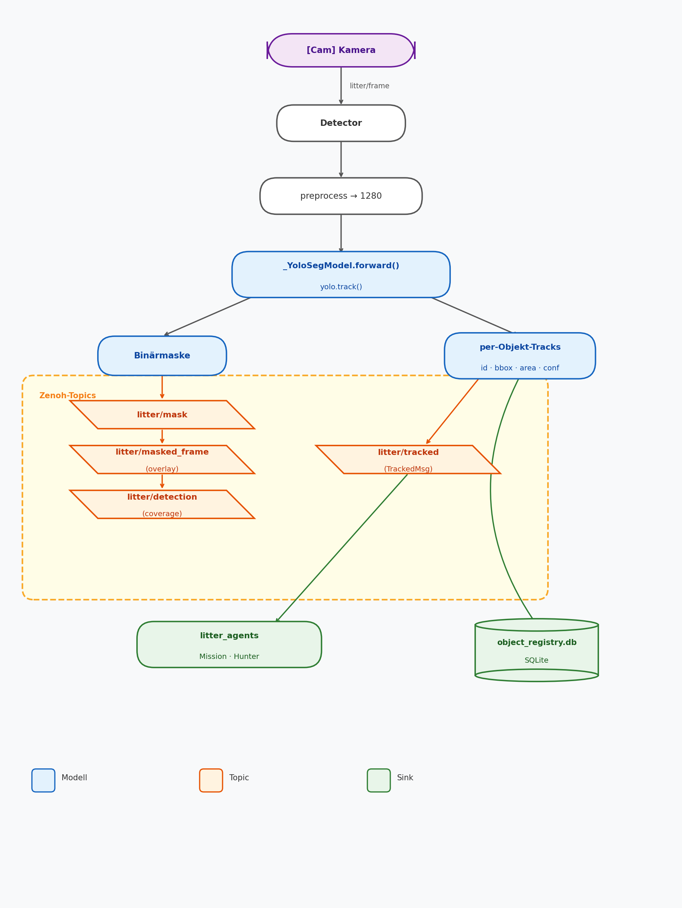

# YOLO Litter Detection — Pipeline & Änderungen

Dokumentiert die YOLO-Integration für die Litter-Detection: Trainings-Pipeline,
Live-Detector, Zenoh-Ausgabe (inkl. Tracker), SQLite-Registry und die
Test-Ergebnisse.

## Architektur / Datenfluss



**Kernidee:** Ein `_YoloSegModel`-Wrapper (`src/litter_detector/detector/model.py`)
kapselt das Ultralytics-YOLO hinter der bestehenden Segmentierungs-Schnittstelle
(`model(tensor) → logits`). Dadurch bleibt `main.py`/`postprocess` als Drop-in
erhalten und liefert dieselbe Binärmaske wie zuvor — zusätzlich werden pro Objekt
Tracks (mit stabilen IDs) exponiert und auf Zenoh sowie in eine SQLite-DB geschrieben.

## Was erledigt wurde

### 1. Umgebung (GPU)
- `pyproject.toml`: PyTorch von **Nightly-cu128 → Stable-cu128** umgestellt,
  `prerelease=allow` entfernt, **`uv.lock`** erzeugt.
- Ergebnis: `torch 2.11.0+cu128`, CUDA aktiv auf der RTX 5070 Ti (vorher CPU).

### 2. YOLO in den Detector eingebaut
- `_YoloSegModel`-Wrapper als Drop-in für das alte U-Net.
- Bugfix: YOLO ist ein `nn.Module` und überschreibt `.train()`; `model.eval()`
  löste versehentlich ein echtes Training aus. Behoben (YOLO nicht als
  nn.Module-Kind registrieren + `train()` neutralisiert).

### 3. Inferenz-Tuning (ohne Retraining)
- Inferenz-Auflösung **1280** (`YOLO_IMGSZ`)
- Confidence **0.25** (`YOLO_CONF`) — präzisionsfreundlicher Default gegen Fehlalarme
  (für maximalen Recall ggf. auf 0.05 senken)
- Flächenfilter **0.0005** (`YOLO_MIN_AREA`) — verwirft winzige Speck-Detektionen
- Masken-Dilatation **0** (`YOLO_MASK_DILATE`)
- TTA verworfen (von Segmentierungsmodellen nicht unterstützt)

### 4. Tracker-Ausgabe für Zenoh
- `yolo.track()` (ByteTrack, persistente IDs) statt `predict()`.
- Neues Topic **`litter/tracked`** mit `TrackedMsg`
  (`{timestamp_ns, tracks:[{id, bbox:[x,y,w,h], area_px, first_seen_ns,
  last_seen_ns, n_observations}]}`) — schema-kompatibel zu
  `litter-agent-V1`/`detection_tracking`.

### 5. SQLite-Object-Registry
- `src/litter_detector/detector/registry.py`, Schema identisch zu
  `detection_tracking` (Tabelle `objects`, Upsert pro Frame).
- Pfad via `registry_db_path` (Default `object_registry.db`, leer = aus).

## Test-Ergebnisse

### Trainingsläufe (Mask-Metriken, TACO-Subset: 1275 train / 225 val, 1 Klasse)

| Lauf | mAP50 | Recall | mAP50-95 | Anmerkung |
|------|-------|--------|----------|-----------|
| yolov8s@640 (Baseline) | 0.433 | 0.41 | 0.271 | — |
| yolo11m@960 | 0.405 | 0.382 | 0.250 | Batch≈1-Engpass (12 GB) |
| yolo11s@640 (15 ep) | 0.412 | 0.384 | 0.256 | untertrainiert |
| yolo11s@640 (30 ep) | 0.434 | 0.395 | 0.270 | = Baseline |
| yolo11s@768 (30 ep) | 0.440 | 0.409 | 0.278 | bester mAP50 (within noise) |
| **yolo11s@768 + copy_paste/mixup** ✅ | 0.437 | 0.401 | 0.277 | **Default (aktiv) — reproduzierbar via `train_yolo.py`** |

→ Alle Modell-/Trainings-Hebel pendeln um mAP50 ~0.44 = **Datendecke** des Subsets.
Weiterer Gewinn nur über mehr/domänennähere Daten.

### Recall-Inferenz (Val-Bilder, erkannte Instanzen)

| Anpassung | Effekt |
|-----------|--------|
| imgsz 384 → 960 (conf 0.15→0.10) | Instanzen 87 → 165 (~+90 %), Treffer 23/25 → 25/25 |
| conf 0.10 → 0.05 @1280 | Instanzen 243 → 401 (+65 %), Coverage 0.139 → 0.169 |
| imgsz 960 → 1280 @conf 0.05 | Instanzen 401 → 430 (+7 %), +2 ms |
| Masken-Dilatation 0/5/9 | Coverage 0.155 / 0.160 / 0.164 |

### Tracker & Registry
- Stabiler Stream (Bild 6× wiederholt): **4 Tracks mit persistenten IDs [1–4]**,
  `n_observations` zählt korrekt auf 6 hoch.
- SQLite: 4 Zeilen persistiert, `first_seen_ns` über Upserts erhalten,
  `n_observations` akkumuliert, Boxen/Flächen korrekt.

### Performance
- Inferenz **~30 ms/Frame** auf der RTX 5070 Ti (yolo11s @ 1280).

## Konfiguration (Env-Vars)

| Variable | Default | Wirkung |
|----------|---------|---------|
| `MLFLOW_MODEL_URI` | `models/best_yolo11s_seg.pt` | aktives Modell (`.pt` = YOLO; `models:/…` = U-Net-Fallback) |
| `YOLO_IMGSZ` | `1280` | Inferenz-Auflösung |
| `YOLO_CONF` | `0.25` | Confidence-Schwelle (niedriger = mehr Recall, höher = weniger Fehlalarme) |
| `YOLO_MIN_AREA` | `0.0005` | Min. Maskenfläche als Bildanteil; verwirft winzige Speck-Fehlalarme (0 = aus) |
| `YOLO_MASK_DILATE` | `0` | Masken-Dilatation in px (0 = aus) — vergrößert Fläche |
| `YOLO_MASK_ERODE` | `0` | Masken-Erosion in px (0 = aus) — verkleinert Fläche |
| `YOLO_MASK_THRESH` | `0.5` | Binarisierungs-Schwelle (höher = enger; bei YOLO-Seg kaum wirksam) |
| `REGISTRY_DB_PATH` | `object_registry.db` | SQLite-Registry (leer = aus) |

## Verwendung

```bash
# Training (yolo11s @ 768, batch 10, 30 ep — Config in train_yolo.py)
uv run python auto-research/train_yolo.py

# Live-Detector (nutzt models/best_yolo11s_seg.pt als Default)
uv run detector

# Noch weniger Fehlalarme (Recall ↔ Precision)
YOLO_CONF=0.35 uv run detector
```

## Modelle

| Datei | Modell | Status |
|-------|--------|--------|
| `models/best_yolo11s_seg.pt` | yolo11s-seg @ 768 | **Default (aktiv)** |
