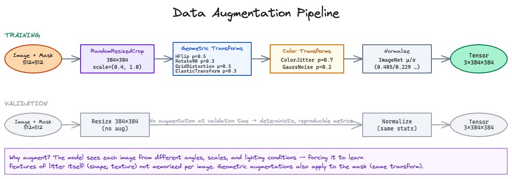
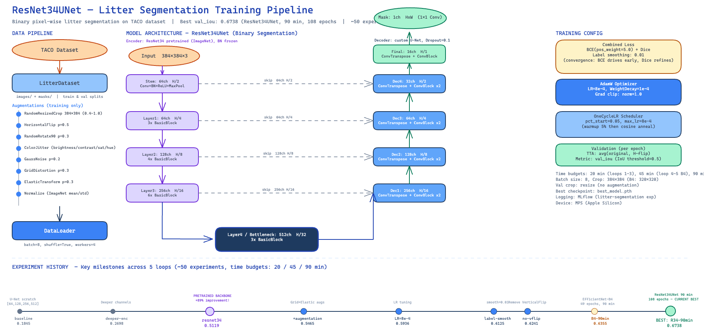
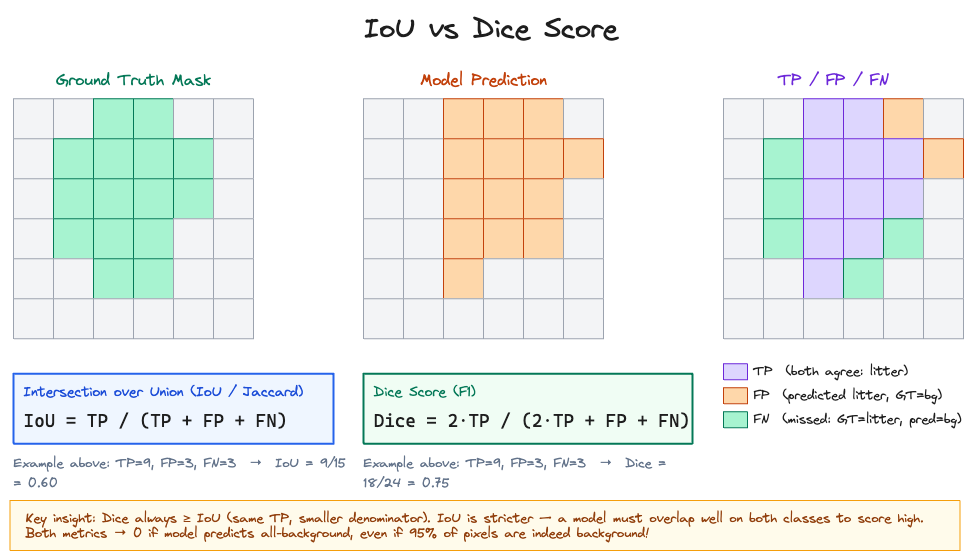
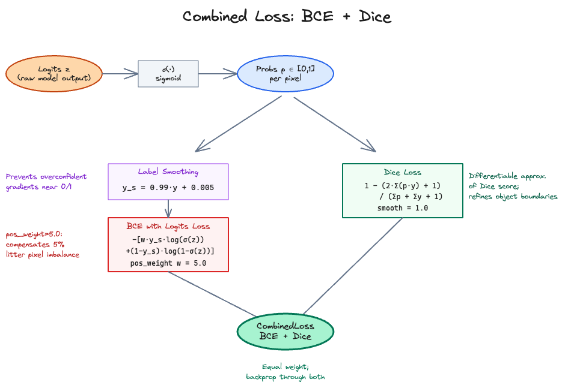
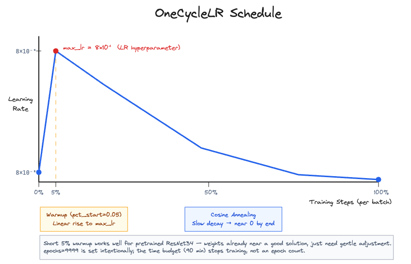

# Litter Detection: Concepts Explained

This document walks through the key ideas behind a pixel-wise litter segmentation model trained on the [TACO dataset](http://tacodataset.org/). The model learns to highlight every litter pixel in an image — like a highlighter pen for trash.


---

## 0. What the Dataset Looks Like

The model is trained on 1 500 images (512 × 512 px) sourced from TACO via HuggingFace. For each image, a binary mask marks every pixel that contains litter. Only **~5 % of all pixels** are litter — the rest is background. This extreme imbalance is one of the central challenges.

Three examples from the validation set:

### Sparse litter (~1.7 % of pixels)

| Image | Mask |
|-------|------|
|  |  |

### Medium litter (~10 % of pixels)

| Image | Mask |
|-------|------|
|  |  |

### Dense litter (~38 % of pixels)

| Image | Mask |
|-------|------|
|  |  |

---

## 1. Data Preparation

**Script:** `prepare.py`

The raw TACO dataset stores annotations in COCO format: polygons that trace the outline of each piece of litter. `prepare.py` converts these polygons into binary raster masks (one PNG per image) and resizes everything to 512 × 512 px.

Key steps in `prepare.py`:

```
HuggingFace download
    ↓
COCO polygon annotations
    ↓  polygon_to_mask()
Binary mask PNGs (0 = background, 255 = litter)
    ↓
Resize to 512×512, stratified split
    ↓
data/train.txt (1275 images)   data/val.txt (225 images)
```

**Class imbalance.** With only 5 % litter pixels the naive model can achieve 95 % pixel accuracy by simply predicting all-background. We address this in the loss function (see Section 4).

---

## 2. Data Augmentation

Every training image is randomly transformed before it enters the network. Augmentation exposes the model to more variation, preventing it from memorising specific images.



**Training transforms** (applied consistently to both image and mask):

| Transform | Purpose |
|-----------|---------|
| `RandomResizedCrop(384, scale=(0.4, 1.0))` | Random zoom + crop; forces scale invariance |
| `HorizontalFlip(p=0.5)` | Mirror image left-right |
| `RandomRotate90(p=0.3)` | 90 ° rotations; litter can appear at any angle |
| `GridDistortion(p=0.3)` | Local grid warping; mimics curved surfaces |
| `ElasticTransform(p=0.3)` | Smooth elastic deformation |
| `ColorJitter(p=0.7)` | Random brightness, contrast, saturation, hue |
| `GaussNoise(p=0.2)` | Adds realistic sensor noise |
| `Normalize(μ=ImageNet, σ=ImageNet)` | Shifts pixel values to match pretrained weights |

**Validation:** only `Resize(384)` + `Normalize`. No random transforms — evaluation is deterministic.

> **Note:** Geometric transforms are applied identically to the image and its mask. This keeps pixels aligned.

---

## 3. Model Architecture

The model is a **ResNet34 U-Net**: a pretrained ResNet34 encoder extracts multi-scale features; a 4-stage decoder upsamples them back to full resolution; skip connections preserve fine-grained spatial detail.



### Encoder — ResNet34 (pretrained on ImageNet)

| Stage | Output channels | Resolution (relative) | Notes |
|-------|----------------|-----------------------|-------|
| Stem (Conv7×7 + MaxPool) | 64 | H/4 | Converts RGB to feature map |
| Layer 1 (3 × BasicBlock) | 64 | H/4 | Skip → Dec4 |
| Layer 2 (4 × BasicBlock) | 128 | H/8 | Skip → Dec3 |
| Layer 3 (6 × BasicBlock) | 256 | H/16 | Skip → Dec2 |
| Layer 4 (3 × BasicBlock) | 512 | H/32 | Bottleneck (deepest) |

> **BatchNorm layers are frozen.** The pretrained BN running statistics are preserved; only the convolution weights are fine-tuned.

### Decoder — U-Net style

| Stage | Output channels | Resolution | Operation |
|-------|----------------|------------|-----------|
| Dec1 | 256 | H/16 | ConvTranspose2d + cat(skip from L3) + ConvBlock |
| Dec2 | 128 | H/8 | ConvTranspose2d + cat(skip from L2) + ConvBlock |
| Dec3 | 64 | H/4 | ConvTranspose2d + cat(skip from L1) + ConvBlock |
| Dec4 | 32 | H/2 | ConvTranspose2d + cat(skip from Stem) + ConvBlock |
| Final | 16 | H/1 | ConvTranspose2d + ConvBlock |
| Head | 1 | H/1 | 1×1 Conv → raw logit per pixel |

**Total parameters:** 24.3 M (mostly from the ResNet34 encoder)

**Why skip connections?** The encoder gradually compresses spatial resolution to build high-level semantics. Skip connections route the original, spatially detailed features directly to the decoder — combining "what" with "where".

---

## 4. IoU and Dice Score

Before we can train the model, we need to measure how good its predictions are.



At evaluation time each pixel is classified as litter (1) or background (0) by thresholding the model's output probability at 0.5:

```python
preds = sigmoid(logits) > 0.5   # boolean mask
inter = (preds * masks).sum()    # True Positives
union = preds.sum() + masks.sum() - inter
IoU   = inter / max(union, 1.0)
```

### Intersection over Union (IoU)

$$\text{IoU} = \frac{TP}{TP + FP + FN}$$

- **TP** (True Positive): predicted litter and ground truth agrees
- **FP** (False Positive): predicted litter, actually background
- **FN** (False Negative): missed litter (predicted background)

The denominator is the *union* — every pixel that either the model or the ground truth labels as litter.

### Dice Score (F1)

$$\text{Dice} = \frac{2 \cdot TP}{2 \cdot TP + FP + FN}$$

Dice scores the same true positives but divides by `2·TP + FP + FN` (smaller than union), so **Dice ≥ IoU** always.

| Metric | Denominator | Sensitivity to errors |
|--------|-------------|----------------------|
| IoU | TP + FP + FN | Stricter; penalises any mistake |
| Dice | 2·TP + FP + FN | Gentler; used as training signal |

**Critical insight for imbalanced segmentation:** If the model predicts all-background, `TP = 0` → **IoU = Dice = 0**, regardless of how many background pixels it correctly ignored. This forces the model to actually detect litter rather than take the easy path of predicting nothing.

---

## 5. Combined Loss Function

The loss is computed on soft probabilities (before thresholding) so gradients flow.



### BCE with Logits Loss

Binary Cross-Entropy applied to raw logits. For each pixel *i*:

$$\mathcal{L}_\text{BCE} = -\left[ w \cdot y_s \cdot \log\sigma(z) + (1-y_s) \cdot \log(1-\sigma(z)) \right]$$

where:
- $z$ is the raw logit output
- $\sigma(z)$ is the predicted probability
- $y_s$ is the smoothed label (see below)
- $w = \text{pos\_weight} = 5.0$ — extra weight for litter pixels

**pos_weight = 5.0** means the model is penalised 5× more for missing a litter pixel than for falsely flagging a background pixel. This compensates for the 5 % class imbalance.

### Label Smoothing

Raw binary labels (0 or 1) push the model to produce extreme probabilities, which destabilises training. Label smoothing gently rounds them:

```python
y_smooth = y * 0.99 + 0.005   # 1 → 0.995, 0 → 0.005
```

This means the model is rewarded for predicting *confident but not extreme* probabilities.

### Dice Loss

The differentiable Dice loss directly optimises the Dice score:

$$\mathcal{L}_\text{Dice} = 1 - \frac{2\sum(p \cdot y) + 1}{\sum p + \sum y + 1}$$

where $p = \sigma(z)$ are soft probabilities. The "+1" smooth term prevents division by zero on empty masks.

### Combined Loss

```python
Loss = BCE(logits, y_smooth) + Dice(logits, y)
```

The two terms are complementary:
- **BCE** provides strong gradient signal on each pixel early in training
- **Dice Loss** refines region-level overlap and object boundaries

---

## 6. OneCycleLR Scheduling

The learning rate is not fixed — it follows a warm-up then cosine decay schedule:



```python
scheduler = OneCycleLR(
    optimizer,
    max_lr     = 8e-4,
    steps_per_epoch = steps_per_epoch,
    epochs     = 9999,        # effectively unlimited; time budget stops training
    pct_start  = 0.05,        # 5% of steps spent warming up
)
```

**Phase 1 — Warmup (5 % of steps):** LR rises linearly from `max_lr / 10` to `max_lr`. Prevents large updates from destabilising the pretrained weights immediately.

**Phase 2 — Cosine Anneal (95 % of steps):** LR decays smoothly toward zero. As the model improves, smaller updates allow fine-grained refinement.

**Why such a short warmup?** The ResNet34 encoder starts with excellent ImageNet features — it doesn't need much coaxing. A longer warmup wastes the time budget without benefit. Experiment `resnet34-aug-pct-start-0p15` (warmup = 15 %) confirmed this was worse.

**Why `max_lr = 8e-4`?** Found empirically — experiments at 1e-4 were too slow, 1.2e-3 introduced instability, 8e-4 was the sweet spot.

---

